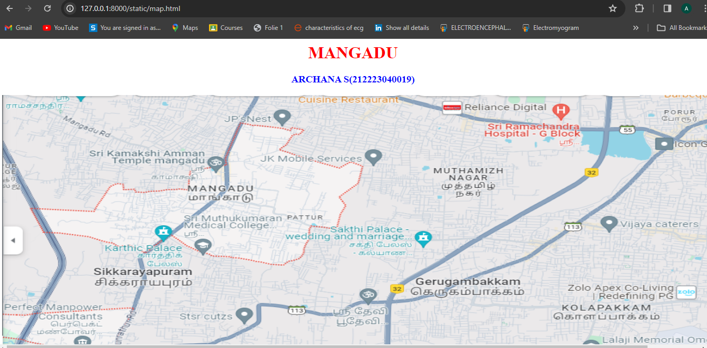
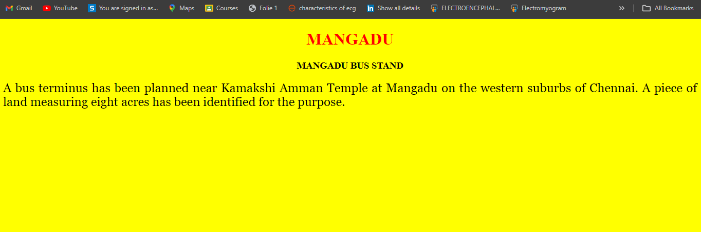
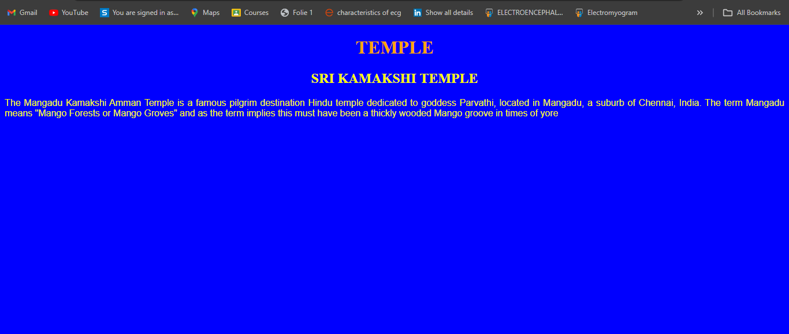

# Ex04 Places Around Me
## Date: 25.10.23

## AIM
To develop a website to display details about the places around my house.

## DESIGN STEPS

### STEP 1
Create a Django admin interface.

### STEP 2
Download your city map from Google.

### STEP 3
Using ```<map>``` tag name the map.

### STEP 4
Create clickable regions in the image using ```<area>``` tag.

### STEP 5
Write HTML programs for all the regions identified.

### STEP 6
Execute the programs and publish them.

## CODE
```
map.html
<html>
<head>
    <title>MY CITY</title>
</head>
<body>
<h1 align="center">
    <font color="red"><b> MANGADU </b></font>
</h1>
<h3 align="center">
    <font color="blue"><b> ARCHANA S(212223040019) </b></font>
</h3>
<center>

<map name="MyCity">
<area shape="rect" coords="950,120,1100,140" href="home.html" title="My Home Town">
<area shape="rect" coords="330,250,900,900" href="hospital.html" title="My Home Town">
<area shape="rect" coords="100,120,300,300" href="temple.html" title="My Home Town">
</map
</center>
</body>
</html>

mangadu.html
<!DOCTYPE html>
<html lang="en">
<head>
<title>mangadu</title>
</head>
<body bgcolor="yellow">
<h1 align="center">
<font color="red"><b>MANGADU</b></font>
</h1>
<h3 align="center">
<font color="black"><b>MANGADU BUS STAND</b></font>
</h3>
<p align="justify">
    <font face="Georgia" size="5">
        A bus terminus has been planned near Kamakshi Amman Temple at Mangadu on the western suburbs of Chennai. A piece of land measuring eight acres has been identified for the purpose.
    </p>
</body>
</html>

temple.html
<!DOCTYPE html>
<html lang="en">
<head>
<title>TEMPLE</title>
</head>
<body bgcolor="blue">
    <h1 align="center">
    <font color="orange">
        TEMPLE</h1>
        <h2 align="center">
            <font color="yellow">
                SRI KAMAKSHI TEMPLE</h2>
        <p align="justify">
            <font face="arial">
                The Mangadu Kamakshi Amman Temple is a famous pilgrim destination Hindu temple dedicated to goddess Parvathi, located in Mangadu, a suburb of Chennai, India. The term Mangadu means "Mango Forests or Mango Groves" and as the term implies this must have been a thickly wooded Mango groove in times of yore
            </p>
        </body>
    </html>
                

```


## OUTPUT





## RESULT
The program for implementing image maps using HTML is executed successfully.
